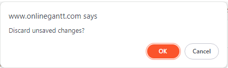
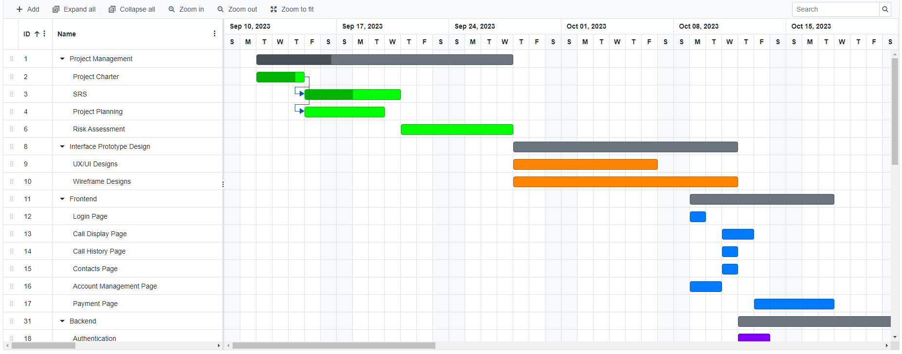

# Opening the .gantt file:
1. Visit: https://www.onlinegantt.com/
2. Select "Open (.gantt file)

3. Select "OK" to discard unsaved changes

4. Open A3.gantt to view the project breakdown, start date, end date and apprx duration

5. To view task assignments, click the dropdown menu and select "Resource View"
