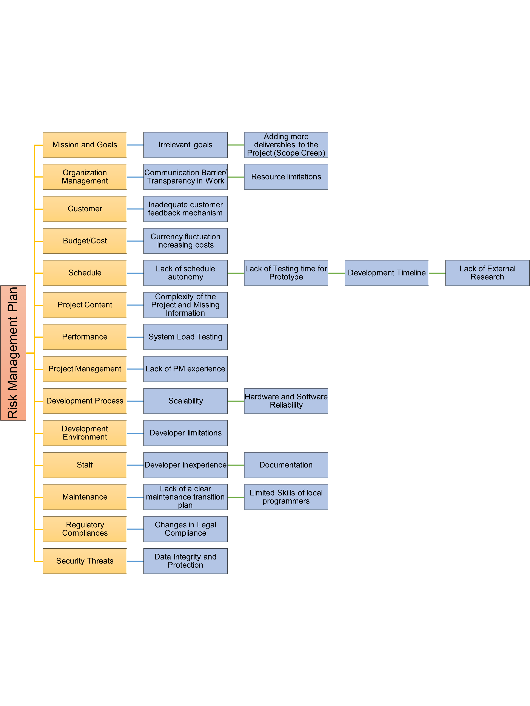

<H1>
  
  
  
Automated Railway Reseration System (ARRS)
  
Risk Management Plan
  
Version 1.1
  
November 09, 2023
  
  
  
Team Endgame
  
  
  
  
  
  
</H1>

<H1>Introduction</H1>

This document offers a comprehensive overview of the potential risks associated with the automated railway reservation system (ARRS). All identified risks have been assigned a probability of occurring along with the financial impact they would have if they came to fruition. Of the risks identified, a select few were reasoned to have the most severe repercussions and thus a response strategy for each has been developed. 

<H1>Risk Identification and Ranking</H1>

## Risk Categories and Identification

### Mission and goals 
- The requirement that the system accommodate other railroads is irrelevant to the CRM.
- The scope creep, additional deliverables are being added to the prototype without extending the deadlines.

### Organization management
- Limited to the resources provided by the CRM, unable to bring in any additional team members that the PM may need. 
The language barrier within the team, since some of the team members cannot speak or write English.

### Customer
- The potential for insufficient customer engagement processes, leading to a lack of critical feedback that may not align with user expectations.

### Budget/cost
- The project budget is vulnerable to exchange rate volatility, which could inflate the cost of resources gotten from abroad.

### Schedule
- The PM appears to have little say in the deadlines that are being imposed by the CRM. 
- Imposed dates and their belief that the project is easily doable with CASE tools may lead to improper testing and quality assurance.
- The timeline of developing, testing, and integrating a prototype within 90 days poses a risk as it may not provide sufficient time for development. Rushed development increases the likelihood of overlooking critical issues, resulting in a prototype with unresolved bugs and reduced performance.
- Lack of complete research before starting the development creates critical situations for developers to go back and forth everytime a new research conflict with the previous phase.

### Project content
- The implementation of a complex database to run complex queries, may require additional resources, allocate more budget and extra time.

### Performance 
- The difference in the expected number of reservations during testing and actual deployment. Higher numbers could cause the system to fail in terms of speed and responsiveness.

### Project management 
- The limited experience in project management and their need for domain expertise.

### Development process 
- The reliance on CRM-provided state-of-the-art hardware and software introduces a risk because the historical track record of unsuccessful projects within CRM suggests potential challenges. Even though the components are considered advanced, past failures may indicate issues in implementation, integration, or compatibility that could impact the reliability of the ARRS.
- The risk associated with scalability arises from the need to transition from a successful prototype to a full-scale system. Inadequate experience among developers in designing hardware infrastructure for scalability increases the likelihood of encountering challenges when expanding the system.

### Development environment
- While the CRM will provide the physical resources, the PM is prohibited from bringing anything additional into the country that they may need along the way 

### Staff
- Most developers that are being provided lack prior experience with software engineering concepts esp object oriented programming which will be used to create the system 
- The communication barrier within the team, particularly if CRM personnel do not fully understand the software components due to language issues, poses a risk. Incomplete or inaccurate documentation may lead to operational errors and system instability, as the team may struggle to interpret and implement the intended functionalities correctly.

### Maintenance 
- Local developers do not know about object-oriented programming and telecommunications which could impact on the stability and maintenance of software
- The absence of a clearly defined transition plan for maintenance responsibilities, from development to operation, could lead to system downtime, and increased long-term 

### **Security Threat**
- Because of lack of experience of developers in an agile environment. Factor of not following each phases promptly can lead to successful breaches.  Not only can data breaches cause financial losses, but they can also harm the ARRS's reputation and weaken user confidence.

### **Regulatory Compliance**
- The risk arises from the diverse geographical origins of the development team, leading to potential variations in legal regulations. Differences in legal frameworks and compliance standards may affect the team's understanding of regulatory requirements.

## Risk Graph Representation

## Risk Table (Sorted based on Risk Exposure)

| **Risk** | **Category** | **Description** | **Probability** | **Loss** | **Risk Exposure** |
| --- | --- | --- | --- | --- | --- | 
|Lack of Testing time for Prototype |Schedule|The dates are purely imposed by the marketing manager without involvement of the software development team and management thinks that the project will be easily doable since the team is using CASE tool. However, they’re the ones who're going to get the training at the end of 15 months.|0.6|$100,000|$60,000|
Communication Barrier/ Transparency in Work|Organization Management|None of the team members speak Chinese and everyone including the PM is relying on interpreters. PM has access to 26 software development professionals but half of them were not able to speak or write english. Ineffective communication in this project can lead to misunderstanding and difficulties in making decisions.|0.7|$60,000|$42,000|
Lack of Testing time for Prototype |Schedule|The dates are purely imposed by the marketing manager without involvement of the software development team and management thinks that the project will be easily doable since the team is using CASE tool. However, they’re the ones who're going to get the training at the end of 15 months.|0.7|$55,000|$38,500|
Changes in Legal Compliance|**Regulatory Compliance**|Since the developers are not from the same country, the legal regulations that they are aware of may be different which can affect project’s progress|0.5|$71,000|$35,500|
Limited skills of Local Programmers|Maintenance|Maintenance mostly done after the final project has been delivered, it requires quite a bit of knowledge for bug-fixing, patching, etc. Local programmers were weak in OO development skills and telecommunication skills.|0.8|$40,000|$32,000|
Resource limitations|Organization Management|Given that the PM is limited to the resources provided by the CRM and unable to bring in any additional team members that they may need, this may lead to delays and/or limited implementation of features. |0.5|$60,000|$30,000|
Lack of schedule autonomy|Schedule|The PM appears to have little say in the deadlines that are being imposed by the CRM. This may result in excessive stress due to missed deadlines, lack of feature implementation, backlogs and a failure to meet client expectations.|0.5|$60,000|$30,000|
Developer limitations|Development Environment|While the CRM will provide the physical resources, the PM is prohibited from bringing in anything additional. This also may result in delays and/or limited implementation of features.|0.4|$65,000|$26,000|
Developer inexperience |Staff|Most developers that are being provided lack prior experience with software engineering concepts esp object oriented programming which will be used to create the system. This may result in technical debt, bugs, delays, and difficulty with implementing new features. |0.9|$31,250|$25,000|
Complexity of the Project and Missing Information|Project Content|Complex system may require additional time, resources, and budget which can delay the final deliverable such as providing several management reports that require more complex database implementation and queries to retrieve the result.|0.6|$41,000|$25,000|
Lack of External Research |Schedule|Lack of research data before starting the development poses risk for developers to go back and forth leading to multiple delays in project timelines.|0.8|$30,000|$24,000|
Adding more deliverables to the Project (Scope Creep)|Mission & Goals|Initial deliverables included a prototype showing the functional requirements and final product will include three cities. Additionally, the PM has to ensure that the project will be applicable to the Thai, Vietnamese, Kampuchean and Burmese Railroads.|0.8|$29,375|$23,500|
Lack of Testing time for Prototype |Schedule|The dates are purely imposed by the marketing manager without involvement of the software development team and management thinks that the project will be easily doable since the team is using CASE tool. However, they’re the ones who're going to get the training at the end of 15 months.|0.7|$50,000|$35,000|
System Load Testing|Performance|The expected number of reservations are quite higher than the numbers are expected to use during the testing period. The number of reservations during the test period may be around 25,000 per day. However, during actual deployment of the product it may fail to meet expectations of speed and responsiveness.|0.5|$44,000|$22,000|
Lack of PM experience|Project Management|PM finished the project management profession certification course six months ago and their prior experience was as project development manager. To execute a project smoothly and in a timely manner, they need domain experience and understanding of specific project topics.|0.5|$44,000|$22,000|
Hardware and Software Reliability|Development Process|CRM provided hardware and software though considered state-of-the-art, developers still may still encounter challenges. Primarily because of the track record of unsuccessful projects within CRM. |0.6|$33,333|$20,000|
Development Timeline |Schedule|Ensuring a prototype is developed, tested and integrated within 90-days presents risks of potential delays and completing thorough testing and quality assurance.|0.8|$25,000|$20,000|
Scalability |Development Process|If the project prototype proves successful and needs to be scaled up to a full-scale system, the hardware infrastructure must be designed with scalability in mind. Given the inadequacy in experience of developers, scalability poses a critical risk.|0.5|$36,000|$18,000|
Documentation|Staff|If CRM personnel do not fully understand the software components given the communication issue, it can lead to operational errors and system instability.|0.5|$40,000|$20,000|
Data Integrity and Protection|**Security Threats** |Potential vulnerabilities in the system can lead to data breaches, compromising data and database integrity.|0.2|$45,000|$9,000|
Inadequate customer feedback mechanism.|Customer|The potential for insufficient customer engagement processes, leading to a lack of critical feedback and a final system that may not align with user expectations or requirements|0.2|$40,000|$8,000|
Currency fluctuation increasing costs|Budget/Cost|The project budget is vulnerable to exchange rate volatility, which could inflate the cost of resources procured from abroad. |0.1|$70,000|$7,000|
Lack of a clear maintenance transition plan|Maintenance|The absence of a structured plan for transitioning the ARRS from development to maintenance could result in operational inefficiencies, and reduced user satisfaction|0.1|$60,000|$6,000|

## Identify the top 5 risks

| **Risk Description** | **Risk Owner** | **Response strategy** | **Action plan** | **Resource** | **Timeline** | **Contingency Plan**|
| --- | --- | --- | --- | --- | --- | --- |
There is a risk of significant scope creep and a lack of focus on the clients needs given that there is a desire to have the system accommodate other railroads. This is irrelevant to the CRM, may lead to the client being unsatisfied with the final product or delays to fulfill requirements outside of what CRM is expecting. | Project Manager | Mitigate |Assess how a focus on multi-system compatibility will impact that project and communicate this to the stakeholders to make them aware of how this will impact the budget, timeline, and scope.|Time to prepare and meet with key stakeholders.|Start mitigation process as soon and possible and finish before starting project initiation.|Should the decision to prioritize compatibility prevail, have all design decisions facilitate this request right from the start to help ensure success and minimize technical debt.  
There is a risk of communication due to a language barrier and reliance on interpreters. This can create layers of complexity and potential misinterpretation such as interpreters may not be able to capture the nuances of the technical discussion. Language barriers could lead to a decision making process which may cause trouble reaching the project deadline and goals.|DevelopmentTeam and Project Manager|Mitigating|Project managers should set up Regular meetings with Stakeholders, development teams, and end-users. Team should use collaborative communication tools, develop a communication plan to make clear goals and avoid misunderstanding.|Allocate $5000 to get a subscription of needed communication tools.|Start as soon as project initiation starts.|Should develop communication channels and schedules for developers to make efficient information exchange. In case primary communication tools become unavailable, have alternative tools ready and ensure that team members know how to use them.
The risk is that the insufficient testing on the prototype, resulting from time constraints, could have a serious impact on the final developed system including unresolved bugs, a less reliable system and failure on loading response.|Development Team and Project Manager|Avoiding |Set up priority:The team should prioritize the critical testing scenarios Use of technology:The team should establish automated testing pipelines to save time.Communication:The team should actively participate in the review process to avoid injection of unknown bugs, and consider continuous development.|Allocate an extra budget of around $20,000 for hiring professional testers and they may require additional testing tools. |Start as soon as functional features are deployed.|Considering to release the prototype with an explicit note of potential risks it might have and a commitment to fixing those issues after release update.
Variations in legal regulations due to developers from different countries can affect the project’s progress.|Legal and Compliance Team|Mitigating|Conduct comprehensive legal compliance training for all team members, focusing on both international and local regulations relevant to the project. Regularly update the team on legal changes.|Allocate $10,000 for legal consultation and training materials.|Begin training in the early stages of the project and give regular updates throughout the project lifecycle.|In the case of significant legal changes, reassess and adjust project plans according to how significant the situation will be. Also, consider hiring legal experts for ongoing support if necessary.
Most developers lack experience in software engineering concepts, especially object-oriented programming, leading to technical debt, bugs, delays, and difficulty in implementing new features.|Development Team|Mitigating|Provide intensive training in software engineering concepts and object-oriented programming. Implement a mentorship program with experienced developers.|Allocate additional budget for training programs and mentorship.|Start training at project commencement and continue throughout the development phase.| In case of persistent skill gaps, consider outsourcing critical development tasks or hiring additional skilled developers.

<H1>Conclusion</H1>

The “Risk Management Plan for ARRS” provides a comprehensive analysis of various potential risks associated with the Automated Railway Reservation System. The document is structured into several key sections, each addressing different aspects of risk management: 

1. Introduction: This section outlines the document’s purpose, which is to offer a detailed overview of potential risks related to ARRS. Each identified risk is evaluated in terms of its likelihood and potential financial impact.
2. Risk identification and Ranking: The risks are categorized and sorted based on their potential loss and exposure. This section is instrumental in prioritizing risks and forms the basis for developing response strategies. 
3. Risk Categories: The document identifies various risk categories, each with specific concerns:
    - Mission and Goals: Issues like scope creep and accommodating requirements irrelevant to the core project (CRM) are highlighted.
    - Organization Management: Challenges include resource limitations and language barriers within the team.
    - Customer: Risks related to the insufficient customer engagement processes are discussed. 
    - Budget/Cost: The vulnerability of the project budget to exchange rate fluctuations is noted.
    - Schedule: Risks associated with tight deadlines, lack of proper testing, and rushed development leading to potential issues with the prototype are mentioned.
    - Project Content: The complexity of implementing a robust database system is acknowledged.
    - Performance: Potential performance issues due to higher-than-expected usage are highlighted.
    - Project Management: The limited experience in project management and the need for domain expertise are identified as risks.
    - Development Process: Risks stemming from reliance on CRM-provided hardware and software and challenges in scalability are discussed.
    - Development Environment: Restrictions on importing additional resources are noted.
    - Staff: The inexperience of developers in key software engineering concepts and communication barriers are mentioned.
    - Maintenance: Concerns about the stability and maintenance of the software due to local developers’ limited knowledge.
    - Security Threats:  The risk of data breaches and the impact on ARRS’s reputation and user confidence is discussed.

The document effectively covers a broad range of risks, providing a thorough understanding of the challenges the ARRS project may face. Each risk category is explored in detail, highlighting specific issues and their potential impact on the project. The meticulous approach is identifying and categorizing risks showcases a comprehensive risk management strategy, crucial for the successful implementation and operation of ARRS.
