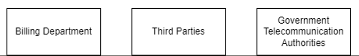
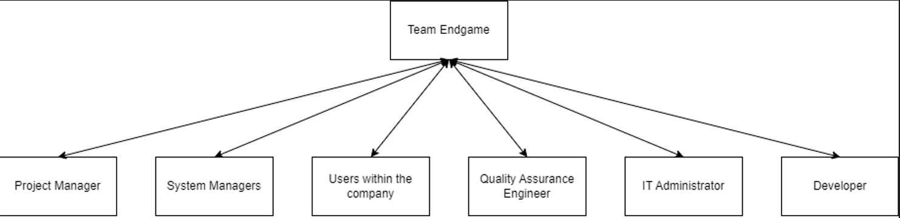

<H1>
  
  
  
Online Virtual Phone System
  
Software Project Management Plan
  
Version 1.0
  
Novemeber 20, 2023
  
  
  
Team Endgame
  
  
  
  
  
  
</H1>

<H1>TABLE OF CONTENTS</H1>

1. [Project Overview](#1-project-overview)
    - [1.1 Purpose, Scope, and Objectives](#11-purpose-scope-and-objectives)
        - [1.1.1 Purpose](#111-purpose)
        - [1.1.2 Scope](#112-scope)
        - [1.1.3 Objectives](#113-objectives)
    - [1.2 Assumptions, Constraints and Risks](#12-assumptions-constraints-and-risks)
        - [1.2.1 Assumptions](#121-assumptions)
        - [1.2.2 Constraints](122-constraints)
        - [1.2.3 Risks](#123-risks)
    - [1.3 Project Deliverables](#13-project-deliverables)
        - [1.3.1 System deliverables](#131-system-deliverables)
        - [1.3.2 Document deliverables](#132-document-deliverables)
    - [1.4 Schedule and Budget Summary](#14-schedule-and-budget-summary)
    - [1.5 References](#15-references)
    - [1.6 Definitions and Acronyms](#16-definitions-and-acronyms)
2. [Project Organization](#2-project-organization)
    - [2.1 Organizational structure](#21-organizational-structure)
    - [2.2 Roles and Responsibilities](#22-roles-and-responsibilities)
3. [Managerial Process Plans](#3-managerial-process-plans)
    - [3.1 Start-up Plan](#31-start-up-plan)
        - [3.1.1 Estimates](#311-estimates)
        - [3.1.2 Staffing](#312-staffing)
        - [3.1.3 Resource Acquisition](#313-resource-acquisition)
    - [3.2 Work Plan](#32-work-plan)
        - [3.2.1 Work Breakdown Structure](#321-work-breakdown-structure)
        - [3.2.2 Schedule Allocation](#322-schedule-allocation)
        - [3.2.3 Resource Allocation](#323-resource-allocation)
        - [3.2.4 Budget Allocation](#324-budget-allocation)
    - [3.3 Project Tracking Plan](#33-project-tracking-plan)
        - [3.3.1 Requirements Control](#331-requirements-control)
        - [3.3.2 Schedule Control](#332-schedule-control)
        - [3.3.3 Communication Plan](#333-communication-plan)
        - [3.3.4 Project Closeout Plan](#334-project-closeout-plan)
4. [Technical Process Plans](#4-technical-process-plans)
    - [4.1 Process Model](#41-process-model)
    - [4.2 Methods, Tools, and Techniques](#42-methods-tools-and-techniques)
    - [4.3 Infrastructure](#43-infrastructure)
    - [4.4 Product Acceptance](#44-product-acceptance)
5. [Supporting Process Plans](#5-supporting-process-plans)
    - [5.1 Documentation](#51-documentation)
    - [5.2 Quality Assurance](#52-quality-assurance)
6. [Additional Plans](#6-additional-plans)

# 1. Project Overview

## 1.1 Purpose, Scope, and Objectives

### 1.1.1 Purpose
The purpose of this document is to provide a formal reference of various components of the Online Virtual Phone System project. The document includes detailed information pertaining to the objectives, schedule, budget, team and resources that will be used to ensure project success. 

### 1.1.2 Scope 
The scope of this project involves providing a cloud-based solution that enables users to make calls over the internet without the need for a traditional physical phone line. The system will allow users to send and receive calls on both their desktop app and mobile app using a single business phone number. The project will include a mobile application that will establish and maintain connections between users to facilitate a voice call along with a user interface that will allow users to make a payment from within the application. 
The project will not involve supplying the servers, hardware or operating systems required to run the system. Any other forms of communication (ie. video calling, photo sharing, messaging, etc.) will not be provided. Payment will be routed through a third party to complete the transaction. The ability to integrate with any other third party applications, aside from what was previously specified, will not be provided.

### 1.1.3 Objectives
The objectives of the Online Virtual Phone System are as follows:
1. Our goal is to create a virtual phone system that will generate $18 million in revenue by the end of the first year of its release. We will do so by charging usage fees and using ad revenue to generate additional income. Increased revenue will allow for additional resources to be implemented to improve customer satisfaction via improved performance. 
2. Build a robust and scalable system that allows for a minimum of 10k users to make calls simultaneously as this will allow for users across the country to access and utilize our service and increase profitability. We expect to have the project completed by October 2024. 
3. Develop a secure and scalable cloud-based solution that allows seamless calling over the internet, with an expected 99.5% uptime. We expect to implement this with deployment of the MVP. This will ensure a high level of customer satisfaction that will improve customer retention and growth. 
For a comprehensive overview of the project requirements, refer to the project SRS section 3. 

## 1.2 Assumptions, Constraints and Risks

### 1.2.1 Assumptions
-   All users will have the ability to connect to the internet with adequate speeds to allow full functionality of the      application.
- All users will own the necessary hardware and operating systems to run the application
- Users will have a credit card or PayPal to make online purchases
- Users will be familiar with one of the 4 languages provided

### 1.2.2 Constraints
- The project is constrained to be completed with a time frame of 13 weeks for a Minimum Viable Product (MVP) and further 1 year for a full system, Any changes to the timeline will be discussed with the client.
- The budget of $120K for MVP and $500K for the whole project. Any changes to the budget will be discussed with the client.
- The system must comply with all the regulatory requirements of the country of deployment.
- The system will rely on the availability of the IP network for communication.
- The system must be scalable for future growth. 

### 1.2.3 Risks

|||
|----|----|
| Security and Access | Implement robust security measures as encryption and authentication |
| Data Loss | Use checksums and data validation techniques to detect and prevent data corruption. |
| Call Quality and Latency | Use a reliable and fast IP network to ensure call quality and low latency. |
| Network Overload | Use a scalable system to handle the load and prevent network overload. |
| Billing Errors | Implement accurate mathematical algorithms to calculate the bill and provide bill auditing.|

## 1.3 Project Deliverables

The following deliverables are expected to be completed and deployed by mid-January 2024. The client documentation and user manual will be available in digital format. The software will be available for download online and on all major app stores. 

### 1.3.1 System deliverables

A working system will be ready for deployment by mid January. The system will offer full functionality of the requirements specified. For a comprehensive list of the software requirements refer to the Software Requirements Specification. 
The software will be distributed on all major digital distribution platforms. 

### 1.3.2 Document deliverables 

There are two categories of documents, documents for client use and documents for administrative purposes. The documents intended for clients include client documentation and user manuals. The project and administrator documentation will be for company use. All of the previously mentioned documents will be completed by mid-December 2024. 
There are also the following documents that will be used by the team, including the Project Charter, SRS, Risk Assessment, Project Management Plan, WBS, Gantt and PERT diagrams. Most of which have been completed and are available on the team Github repository.

## 1.4 Schedule and Budget Summary

Below is a summary of the schedule and budget for the project.

| Project Milestone | Project Artifact | Due Date |
|----|----|----|
| Project Management | Charter, SRS, Risk Management | 09/27/2023 |
| Interface Design | Interface Prototype | 10/11/2023 |
|Frontend Development | System in progress |10/17/2023 |
|Backend Development| System in progress| 11/02/2023|
|Testing| System delivery| 12/13/2023|
|Project Deployment| Training modules| 01/10/2024|
|Project Closure| User and admin documentation, feedback| 01/15/2024|

## 1.5 References

Below is a list of documents and other sources of information referenced in this Plan:
- Project Charter for section 1.1 - 1.3
- SRS for section 1.6 
- Gantt.png for section 1.4*

    *For a comprehensive overview of the project schedule, refer to this document

## 1.6 Definitions and Acronyms

Below is a list of all terms and acronyms required to properly understand this Plan:

|Term | Definition, Acronym or Abbreviations|
| ---- | ---- |
|SRS |Software Requirement Specification|
|OS|Operating System|
|GUI|Graphical User Interface|
|MFA|Multi-Factor Authentication|
|OVPS|Online Virtual Phone System|
|CRM|Customer Relationship Management|
|VoIP|Voice over Internet Protocol|

# 2. Project Organization

## 2.1 Organizational structure

### 2.1.1 External structure

1. Billing Department
    - Manages billing, invoicing, and payment processing for the virtual phone system.
    - Collaborates with the project team for billing system integration.
2. Third Parties
    - External service providers, suppliers, or consultants such as APIs provider for payment.
3. Government Telecommunication Authorities
    - Regulatory bodies or authorities overseeing compliance, licensing, and watching on  laws and regulations.
    - Ensures the project complies with legal and regulatory frameworks.

### 2.1.2 Internal structure

1. Project Manager
    - Oversees the entire project lifecycle and makes the decisions on the direction of the project.
    - Responsible for planning, execution, monitoring, and closing of the project.
    - Acts as a communicator between stakeholders and the development team.
2. Developers
    - Engineers, programmers, and designers responsible for creating the frontend and backend for the online virtual phone system.
    - Coding, designing interfaces, code review and implementing features.
3. Quality Assurance Team
    - Focuses on testing functionalities, identifying bugs, reporting back to developer teams and ensuring the software meets quality standards.
    - Works closely with developers to resolve issues.
4. System Managers
    - Manage the day- to-day operations of the online virtual phone system.
    - Handle configurations, user permissions, and system maintenance.
5. IT Administrators
    - Provides technical support, infrastructure maintenance, and resolves technical issues.
    - Collaborates with the development team for deployment and system integration.
6. End Users
    - The individuals or businesses utilizing the virtual phone system.
    - Provide feedback, use the system, and may need assistance or training.

## 2.2 Roles and Responsibilities

| Project Role | Project Responsibilities                                                                                                            |
|--------------------------|--------------------------------------------------------------------------------------------------------------------------------------|
| Project Sponsor          | - A project sponsor who acts as the project’s champion, providing direction, financial resources, and support to the team. In the context of this document, this person:   &nbsp;&nbsp;- Approves the request for funding   &nbsp;&nbsp;- Approves the project scope represented in this document   &nbsp;&nbsp;- Sets the priority of the project relative to other projects in their area of responsibility |
| Project Manager          | - A project manager is responsible for the day-to-day management of the project and has specific accountability for:   &nbsp;&nbsp;- Managing the project within the approved constraints of scope, quality, time, and cost   &nbsp;&nbsp;- Delivering the specified requirements, deliverables, and ensuring customer satisfaction   &nbsp;&nbsp;- Providing critical information to team members and stakeholders to keep the project on track |
| Developer                | - Responsibilities include day-to-day development and maintenance of the project, including coding and designing.                    |
| Quality Assurance Engineer| - Responsible for:   &nbsp;&nbsp;- Testing the Quality of the system   &nbsp;&nbsp;- Identifying bugs   &nbsp;&nbsp;- Ensuring delivery of a high-quality system that exceeds user expectations |
| System Managers          | - Responsibilities involve managing:   &nbsp;&nbsp;- Online Virtual Phone System software   &nbsp;&nbsp;- User accounts and their personal information   &nbsp;&nbsp;- User authentication and Troubleshooting |
| IT Administrator         | - Tasks include:   &nbsp;&nbsp;- Hardware maintenance   &nbsp;&nbsp;- Security Risk management   &nbsp;&nbsp;- Network Management   &nbsp;&nbsp;- Infrastructure Planning   &nbsp;&nbsp;- Developer Support   &nbsp;&nbsp;- User Support |
| Users                    | - Provide feedback on user experience and system functionalities.                                                                       |

# 3. Managerial Process Plans
## 3.1 Start-up Plan

### 3.1.1 Estimates

The SPMP details the necessary resources and materials for initiating the project. This includes plans for estimating, staffing, acquiring resources, and training.

### 3.1.1.1 Estimation Plan
The cost estimation for the project are provided as follows considering the client requirements and project deliverables.

|Category|Factors |Confidenct Level|Basis of Estimation|
|----------|----------|----------|----------|
|Estimated Cost| $500,000|High|Detailed cost estimation using a bottom-up approach. Cost breakdown includes development, testing, project management, and contingency.|
|Estimate Schedule|6 months|Mediun-High|Gantt chart-based scheduling, considering the complexity of tasks, dependencies, and historical data from similar projects.|
|Resource Requirements|5 members|Medium|Work breakdown structure (WBS) and resource allocation based on individual tasks and project requirements.|

A detailed breakdown of cost estimation is as: 
| Category            | Cost   | Basis of Estimation                                                 |
|---------------------|--------|------------------------------|
| Software and Tools  | 50,000 | Based on the project requirements and use-case as well as considering the software licensing cost |
| Hardware Costs      | 30,000 | Based on hardware requirements for the project |
| Training            | 20,000 | Based on time needed and complexity of Software  |
| Project Management  | 60,000 | Costs related to project management activities and any associated project management tools.|
| Testing             | 70,000 | Based on the intensity of quality assurance for the project          |
| UX/UI design        | 40,000 | Depending on the complexity of design and expertise required.        |
| Backend servers     | 90,000 | Depending on the infrastructure requirements and hosting costs.      |
| Development Costs   | 90,000 | Depending on the complexity of project requirements and work needed for a seamless product. |
| Administrative Costs| 30,000 | Costs related to administrative activities such as documentation, meetings, and training. |
| Contingency Reserve | 20,000 | 10% of the project budget    |
| **Total Cost**      | **500,000** |       |

### 3.1.1.2 Re-Estimation Plan

Project re-estimation plan with method and tools used for cost, schedule and resource estimation would be as follows:

| Category  | Method  | Tools  | Schedules for Re-evaluations      |
|----------|------------------|--------------------|----------------|
| Cost Re-Estimation | Bottom-up re-estimation| Cost Management Software | Triggered when significant milestones are achieved |
| Schedule Re-Estimation | PERT re-evaluation | Project Management Software | Monthly or when significant milestones are achieved or delayed |
| Resource Re-Estimation | WBS review and reallocation| Resource Management Tools   | Reviews during major project phases and project schedule  |

### 3.1.2 Staffing

1. The staff required to manage the project are as follows:

    - 1 Project Manager
    - 4 Developers
    - 1 Database Administrator
    - 2 UX/UI Designers
    - 2 System Managers
    - 1 IT Administrator
    - 1 Quality Assurance Engineer

2. Staff and Skill Levels required at each phase of the project are as follows: 

| Project Phase          | Personnel                   | Skill Level               |  Number of Employees Needed| 
|------------------------|-----------------------------|---------------------------|----------------------------|
| Project Initiation      | Project Manager            | Senior                    |1                           |
| Requirement and Planning| Project Manager            | Senior                    |1                           |
|                         | UX/UI Designers            | Intermediate              |1                           |
|                         | Developers                 | Senior                    |2                           |
|                         | Database Administrator     | Senior                    |1                           |
| Design                  | UX/UI Designers            | Intermediate              |1                           |
|                         |                            | Senior                    |1                           |
|                         | Developers                 | Intermediate              |1                           |
| Development             | Developers                 | Intermediate              |2                           |
|                         |                            | Senior                    |2                           |
|                         | Database Administrator     | Senior                    |1                           |
|                         | IT Administrator           | Intermediate              |1                           |
| Testing                 | Quality Assurance Engineer | Intermediate              |1                           |
|                         | Developers                 | Senior                    |1                           |
| Deployment              | Project Manager            | Senior                    |1                           |
|                         | System Managers            | Intermediate              |2                           |
|                         | IT Administrator           | Intermediate              |1                           |
| Project Closure         | Project Manager            | Senior                    |1                           |
|                         | UX/UI Designers            | Senior                    |1                           |
|                         | Developers                 | Senior                    |4                           |
|                         | Database Administrator     | Senior                    |1                           |
|                         | IT Administrator           | Intermediate              |1                           |
|                         | Quality Assurance Engineer | Intermediate              |1                           |
|                         | System Managers            | Intermediate              |2                           |

3. Duration of Personnel Assignment:

    - The project manager will be assigned to the project for the entire duration of the project.
    - The senior developers will be assigned to the project for the entire duration of the project.
    - The intermediate developers will be assigned to the project for the development phase of the project.
    - The intermediate UX/UI designers will be assigned to the project for the design phase of the project.
    - The senior UX/UI designers will be assigned to the project for the entire duration of the project.
    - The database administrator will be assigned to the project for the entire duration of the project.
    - The IT administrator will be assigned to the project at the beginning of the development phase of the project.
    - The quality assurance engineer will be assigned to the project at the beginning of the testing phase of the project.
    - The system managers will be assigned to the project for the entire duration of the project. 

4. Sources of Personnel:

    - The project manager will be transferred from within the organization.
    - The senior developers will be transferred from within the organization.
    - The senior UX/UI designers will be transferred from within the organization.
    - The intermediate developers will be hired on contract from outside the organization.
    - The intermediate UX/UI designers will be hired on contract from outside the organization.
    - The database administrator will be hired from outside the organization.
    - The IT administrator will be hired from outside the organization.
    - The quality assurance engineer will be hired on contract from outside the organization.
    - The system managers will be hired from outside the organization.        

### 3.1.3 Resource Acquisition
This resource acquisition plan aims to optimize efficiency, minimize risks, and ensure the availability of all essential resources throughout the OVPS project.

### 3.1.3.1 Identification of resources

The resource acquisition process for the OVPS project involves the following steps:

1. Identification of Resources:

    - Conduct a thorough analysis to identify all necessary resources, including personnel, equipment, hardware, software, licensing, compliance, and tools required for the project.

2. Cost Estimation:

    - Estimate the costs associated with each resource, considering licensing and compliance rates and project-specific requirements.

3. Contingency reserve resource:

    - Conducting a thorough analysis of potential identified risks through risk management plan.

### 3.1.3.2 Assignment of responsibility 

- Project Manager   : Overall responsibility for resource acquisition and timely risk evaluation for contingency reserves.
- Team Member       : Each Team Member is responsible for maintaining the acquired hardware and software resource as well as to make sure the required tools are available throughout the development process.
- HR Manager        : Personnel acquisition and compliance.
- IT Manager        : Oversight of software and hardware acquisition.

### 3.1.3.3 Acquisition plans and needs

- Equipment: Acquire hardware during the initial phase to facilitate development.
- Software: Acquire licenses and necessary software tools during the early stages of the project.

### 3.1.3.4 Constraints

- Budget limitations may impact the scale or timing of resource acquisition.

## 3.2 Work Plan
### 3.2.1 Work Breakdown Structure
| Id | Deliverables of the activity | Start Date | End Date | Acceptance criteria for the work activity products | Predecessor work activities | Successor work  activities |
|----------|----------|----------|----------|----------|----------|----------|
| 1 | Project Management | Sep 12, 2023 | Sep 27, 2023 | - Follow the given subpoints below. | N/A | N/A |
| 2 | &nbsp;&nbsp;&nbsp; Project Charter | Sep 15, 2023 | Sep 14, 2023 | - Approval and sign-off from key stakeholder.  - Clearly defined project objectives and scope. | N/A | Project Planning / SRS |
| 3 | &nbsp;&nbsp;&nbsp; SRS | Sep 15, 2023 | Sep 20, 2023 | - Detailed documentation of functional and non-functional requirements.  - Validation of requirements by project stakeholders. | Project Charter | Risk Assessment |
| 4 | &nbsp;&nbsp;&nbsp; Project Planning | Sep 15, 2023 | Sep 19, 2023 | - Completion of a detailed project plan with timelines and resource allocation. | Project Charter | Risk Assessment |
| 5 | &nbsp;&nbsp;&nbsp; Risk Assessment | Sep 21, 2023 | Sep 27, 2023 | - Risk assessment and mitigation strategies outlined.| Project Planning / SRS | UX / UI |
| 6 | Interface Prototype Design | Sep 28, 2023 | Oct 11, 2023 | - Follow the following subpoints.| N/A | N/A |
| 7 | &nbsp;&nbsp;&nbsp; UX/UI designs | Sep 28, 2023 | Oct 06, 2023 | - Approve developed prototypes and UX/UI desings. | Risk Assessment | Login Page/Account Management Page |
| 8 | Software (Frontend and Backend) | Oct 09, 2023 | Nov 01, 2023 | - Frontend and Backend meeting SRS specification. | N/A | N/A |
| 9 | &nbsp; Frontend | Oct 09, 2023 | Oct 17, 2023 | - Validation against SRS requirement. | N/A | N/A |
| 10 | &nbsp;&nbsp;&nbsp;&nbsp; Login Page | Oct 09, 2023 | Oct 09, 2023 | - Functional and tested login page.| UX/UI designs | Call Display Page/ Call History Page/ Contacts Page |
| 11 | &nbsp;&nbsp;&nbsp;&nbsp; Account Management Page | Oct 09, 2023 | Oct 10, 2023 | - Functional and tested account management page.  | UX/UI designs | Call Display Page/ Call History Page/ Contacts Page |
| 12 | &nbsp;&nbsp;&nbsp;&nbsp; Call Display Page | Oct 11, 2023 | Oct 12, 2023 | - Functional and tested call display page. | Login Page /Account Management Page | Payment Page |
| 13 | &nbsp;&nbsp;&nbsp;&nbsp; Call History Page | Oct 11, 2023 | Oct 11, 2023 | - Functional and tested call history page. | Login Page /Account Management Page | Payment Page |
| 14 | &nbsp;&nbsp;&nbsp;&nbsp; Contacts Page | Oct 11, 2023 | Oct 11, 2023 | - Functional and tested contacts page. | Login Page /Account Management Page | Payment Page |
| 15 | &nbsp;&nbsp;&nbsp;&nbsp; Payment Page | Oct 13, 2023 | Oct 17, 2023 | - Functional and tested payment page. | Call Display Page/Call History Page/ Contacts Page | Unit Testing |
| 16 | &nbsp; Backend | Sep 28, 2023 | Nov 01, 2023 | - Fully developed backend system aligned with SRS specifications. | N/A | N/A |
| 17 | &nbsp;&nbsp;&nbsp;&nbsp; Wireframe | Sep 28, 2023 | Oct 06, 2023 | - Stakeholder approvals.   - Alinged with UX/UI designs. | Risk Assessment | Authentication/User Account Management/Encryption and Security |
| 18 | &nbsp;&nbsp;&nbsp;&nbsp; Authentication | Oct 12, 2023 | Oct 13, 2023 | - Functional and tested authentication. | Wireframe | Call Processing |
| 19 | &nbsp;&nbsp;&nbsp;&nbsp; User Account Management | Oct 12, 2023 | Oct 17, 2023 | - Functional and tested user account management. | Wireframe | Call Processing |
| 20 | &nbsp;&nbsp;&nbsp;&nbsp; Call Processing Logic | Oct 18, 2023 | Oct 24, 2023 | - Functional and tested call processing logic. | User Account Management | Voice Call Encryption |
| 21 | &nbsp;&nbsp;&nbsp;&nbsp; Encryption and Security | Oct 12, 2023 | Oct 26, 2023 | - Functional and tested encryption and security. | Wireframe | Call Processing |
| 22 | &nbsp;&nbsp;&nbsp;&nbsp; Network and Connectivity Logic | Oct 27, 2023 | Nov 01, 2023 | - Functional and tested network and connectivity logic. | Voice Call Encryption | Unit Testing |
| 23 | Testing | Nov 02, 2023 | Dec 13, 2023 | - Thorough testing across all functionalities and features.   - Document the testing results. | Payment Page/ Network and Connectivity Logic | Documentation |
| 24 | &nbsp;&nbsp;&nbsp; Documentation | Dec 14, 2023 | Dec 29, 2023 | - Documentation as per project deliverables and outcomes. | Testing | Training |
| 25 | Training | Jan 01, 2023 | Jan 03, 2023 | - Feedback collection after training.   - Meterials prepared and delivered before hand to all trainees.  | Documentation | Deployment |
| 26 | Deployment | Jan 01, 2023 | Jan 10, 2023 | - Successful deployment of the system in the specified environment. | Training | Project Feedback |
| 27 | Project Feedback | Jan 11, 2023 | Jan 13, 2023 | - Feedback collection from users and stakeholders.   - Work on the feedback to improve the system if needed. | Deployment | Project Closure |
| 28 | Project Closure | Jan 13, 2023 | Jan 15, 2023 | - Completion of all project deliverables and activities.   - Formal closure documentation prepared and approved. | Project Feedback | N/A |

### 3.2.2 Schedule Allocation
1. Scheduling Relationships and Time-Sequencing Constraints:

    - The project work activities are scheduled based on Gantt chart and PERT chart. The Gantt chart is used to schedule the project activities and PERT chart is used to estimate the time required to complete each activity to illustrate concurrent activities and dependencies. 

2. Critical Path Identification:

    - The critical path in the schedule has been identified through PERT chart. This critical path outlines the minimum time required to complete the project. It is important to note that the critical path may change as the project progresses and changes are requested by the client.

3. Constraints on Scheduling:

    - Certain work activities may have scheduling constraints such as dependencies, resource availability, and budget limitations. These constraints are identified and addressed in the project schedule.

#### 3.2.2.4 Schedule Milestones:

1. Key schedule milestones have been identified to assess the progress of the project, they are as followed: 

    - The completion of the project charter
    - SRS
    - Project Planning
    - Risk Assessment
    - Interface Prototype Design
    - Software Development
    - Testing
    - Documentation
    - Training
    - Deployment
    - Project Closure

2. These milestones serve as a basis for project monitoring and control.

### 3.2.3 Resource Allocation

#### 3.2.3.1 Detailed Itemization of Resources are as followed:

Following are the resources required for the project:

1. Computing Resources:

    - High-performance workstations for developers and designers
    - Server infrastructure for backend development and testing
    - Network infrastructure for connectivity and testing
    - Storage infrastructure for data storage and backup
    - Cloud infrastructure for deployment and testing
    - Security infrastructure for encryption and security

2. Software Tools:
    - Integrated Development Environment (IDE) for coding
    - Graphic design tools for UX/UI design
    - Testing tools for quality assurance
    - Project management tools for project planning and tracking
    - Documentation tools for project documentation
    - Communication tools for team collaboration
    - Version control tools for code management
    - Deployment tools for system deployment
    - Security tools for encryption and security
    - Network tools for network and connectivity logic
    - Training tools for training and feedback collection

3. Special Testing and Simulation Facilities:
    - Dedicated testing environment to simulate real-world scenarios
    - Testing tools for performance and security testing
    - Testing tools for load testing
    - Testing tools for unit testing
    - Testing tools for integration testing
    - Testing tools for system testing
    - Testing tools for user acceptance testing

Resource allocation is dynamic and may be adjusted based on project requirements and constraints. Regular resource allocation reviews are conducted to ensure the availability of all necessary resources.

### 3.2.4 Budget Allocation

The budget for the project is estimated to be $500,000. The budget is allocated as follows:

1. Software and Tools: $50,000
    - Computing resources: $10,000
    - Software tools: $40,000
2. Hardware Costs: $30,000
    - Acquisition of hardware for development and testing: $30,000
3. Training: $20,000
    - Training programs and materials: $20,000

4. Project Management: $60,000
    - Project management tools and software: $30,000
    - Administrative support for project management: $30,000

5. Testing: $70,000
    - Special testing and simulation facilities: $50,000
    - Testing tools: $20,000
6. UX/UI design: $40,000
    - Graphic design tools: $40,000

7.  Backend Servers: $90,000
    - Acquisition and setup of backend server infrastructure: $90,000

8. Development Costs: $90,000
    - Development tools and software licenses: $70,000
    - Contingency reserve for development: $20,000

9. Administrative Costs: $30,000
    - Documentation : $20,000
    - Meetings : $5,000
    - Training : $5,000

10. Contingency Reserve: $20,000
    - Unforeseen expenses and risks: $20,000

## 3.3 Project Tracking Plan

### 3.3.1 Requirements Control

1. Requirements changes are reported and controlled through the following steps:
    - Identify the change request
    - Analyze the impact of the change request
    - Approve or reject the change request
    - Implement and Validate the change request
    - Update the requirements documentation

2. The impact of requirement changes is assessed based on the following factors:
    - Project Schedule
    - Project Budget
    - Project Scope
    - Project Quality
    - Project Resources
    - Project Risks
    - Project Stakeholders
    - Project Deliverables
    - Project Documentation
    - Project Training
    - Project Deployment
    - Project Closure 

### 3.3.2 Schedule Control
1. Schedule Control Process:
    - Regular schedule reviews are conducted to assess the progress of the project.
    - If the project is behind schedule, the project manager will identify the cause of the delay and take corrective actions.
    
2. Tools for Schedule Control:
    - Gantt chart
    - PERT chart
    - Project management software
    - Project management tools

3. Objective Criteria for Schedule Control:
    - Project milestones and deliverables will be assessed to determine if the project is on schedule.
    - The critical path will be assessed to determine if the project is on schedule.      

### 3.3.3 Communication Plan

1. Method and Tools for Communication:
    - Project Management Software for communication between the project manager and the development team.
    - Regular meetings will be conducted to discuss project progress and issues.
    - Microsoft Teams will be used for communication between the project team and stakeholders.
    - Regular Communication with the client to ensure the project is on track and meets the client’s requirements.

2. Frequency of Communication:
    - Daily communication between the project manager and the development team.
    - Weekly meetings to discuss project progress and issues.
    - Monthly meetings with the client to discuss project progress and issues.

### 3.3.4 Project Closeout Plan

1. Plans for Project Closeout:
    - Project closure documentation will be prepared and approved.
    - Project deliverables will be delivered to the client.
    - Project feedback will be collected from the client.
    - Project feedback will be used to improve the following:
        - Project management process
        - Development process
        - Testing process
        - Documentation process
        - Training process
        - Deployment process
        - Project closure process

# 4. Technical Process Plans
## 4.1 Process Model
## 4.2 Methods, Tools, and Techniques
## 4.3 Infrastructure
## 4.4 Product Acceptance

# 5. Supporting Process Plans
## 5.1 Documentation
## 5.2 Quality Assurance

# 6. Additional Plans